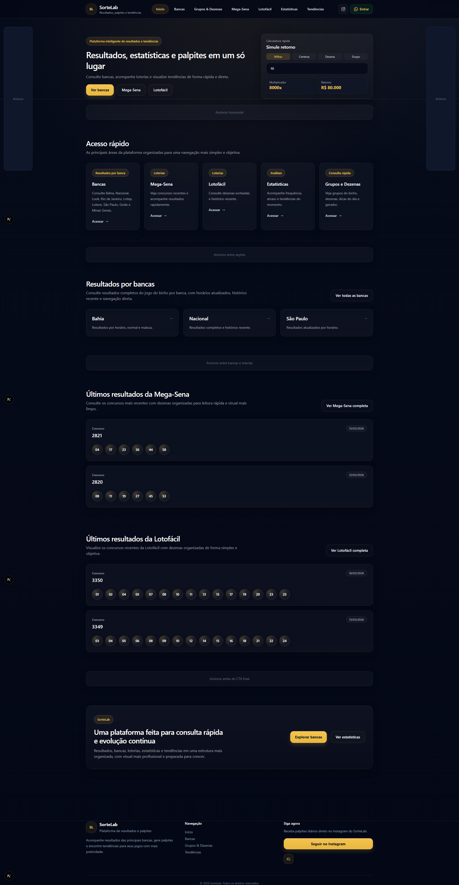
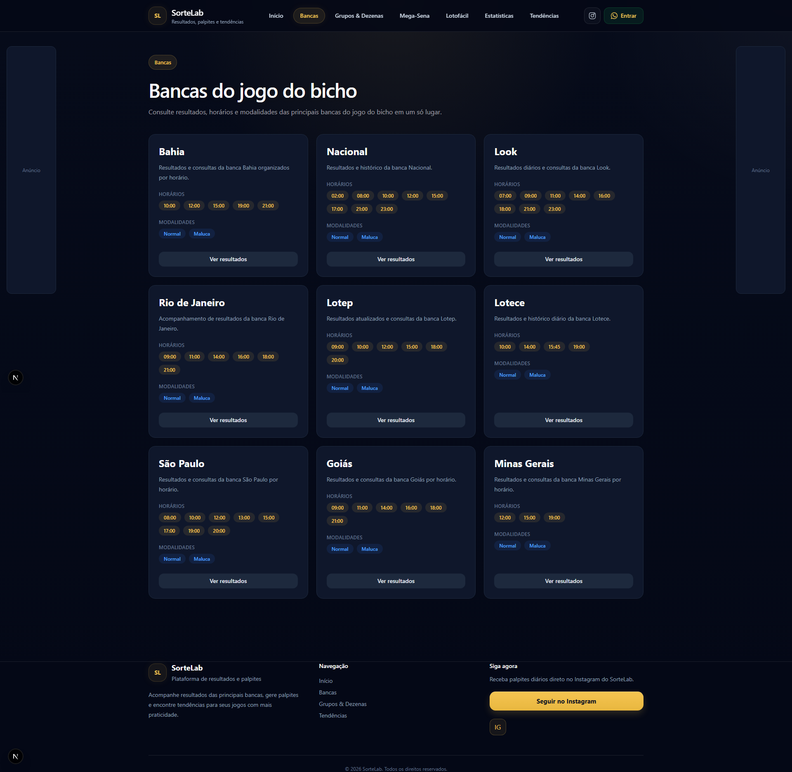
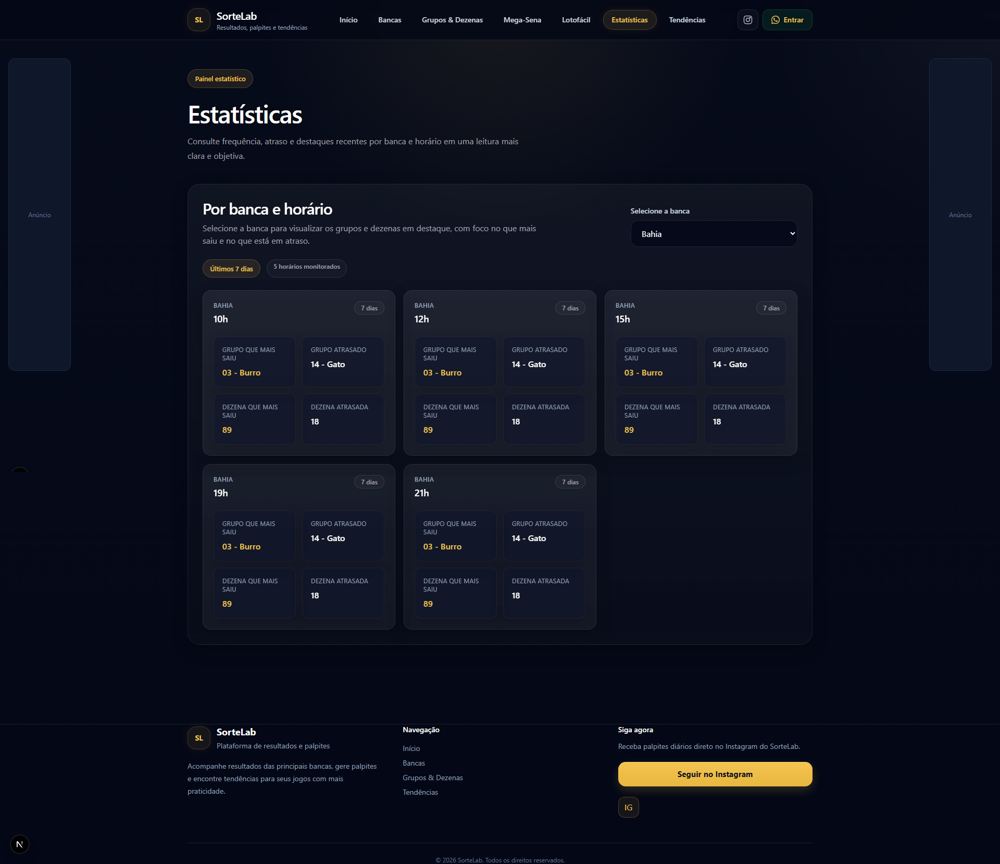
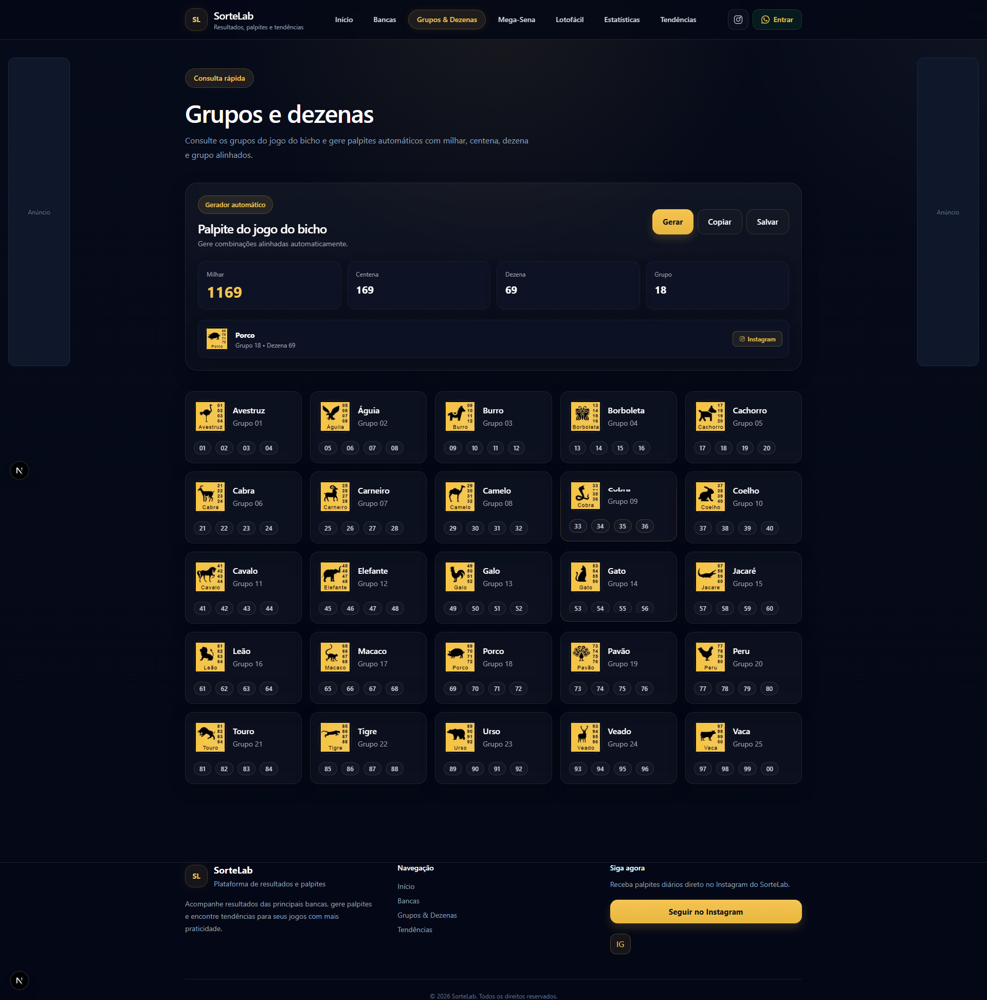
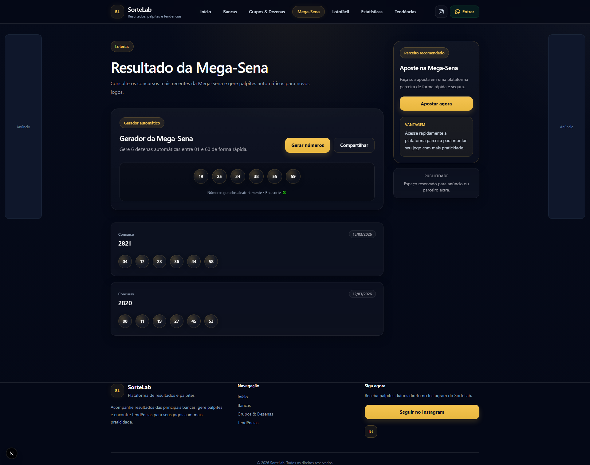
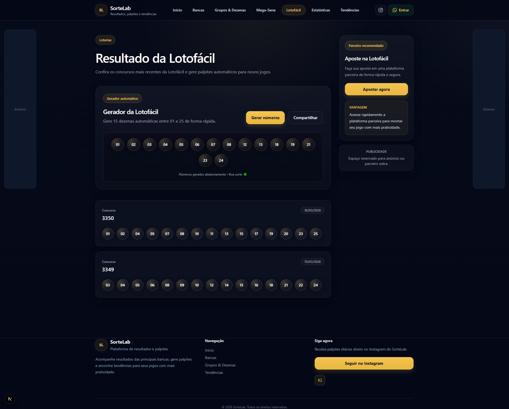
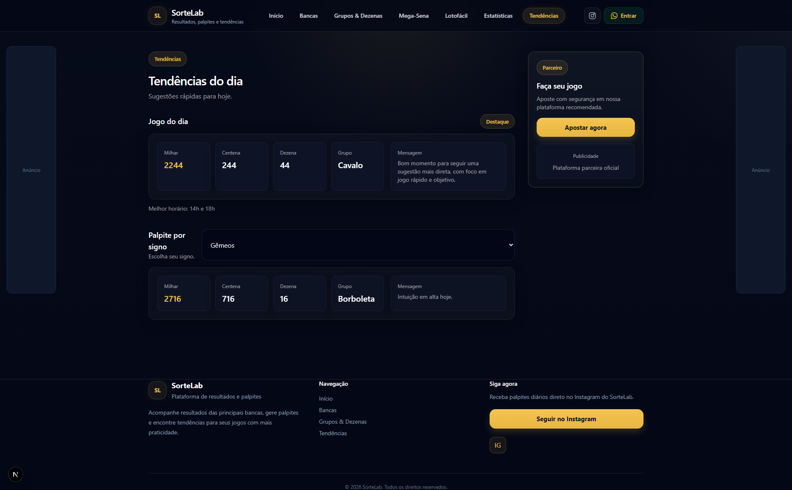

# SorteLab

Aplicação web desenvolvida com foco em uma experiência sofisticada de consulta, organização e visualização de resultados e tendências.

## 🚀 Visão do produto

O SorteLab foi concebido como uma plataforma moderna, com proposta de oferecer uma experiência mais refinada e eficiente para acesso a dados, unindo clareza visual, organização estrutural e facilidade de navegação.

A aplicação vai além da simples exibição de resultados, estruturando informações de forma inteligente para facilitar a tomada de decisão e a leitura rápida.

---

## ✨ Diferenciais

- Interface com design limpo e consistente
- Organização de informações por contexto (bancas, loterias, estatísticas)
- Navegação intuitiva e objetiva
- Estrutura pensada para escalabilidade
- Componentização reutilizável
- Experiência fluida em diferentes dispositivos

---

## 🖥️ Interface

### Home

### Bancas

### Estatísticas

### Grupos e Dezenas

### Mega-Sena

### Lotofácil

### Tendências

---

## ⚙️ Funcionalidades

- Consulta de resultados por banca
- Visualização de loterias (Mega-Sena e Lotofácil)
- Sistema de navegação estruturado por categorias
- Componentização reutilizável
- Simulador de retorno (calculadora integrada)
- Interface responsiva

---

## 🧱 Arquitetura

O projeto foi estruturado com foco em separação de responsabilidades:

- app/ # rotas e páginas
- components/ # componentes reutilizáveis
- public/ # assets estáticos
- screenshots/ # imagens do projeto

Uso de componentização para manter o código escalável e de fácil manutenção.

---

## 🛠️ Tecnologias

- Next.js (App Router)
- React
- TypeScript
- Tailwind CSS

---

## 📈 Evolução

A aplicação foi estruturada para permitir evolução contínua, com possibilidade de integração futura com APIs em tempo real, personalização de usuário e expansão de funcionalidades analíticas.

---

## 📌 Considerações

Projeto desenvolvido com foco em prática real de desenvolvimento, organização de código e construção de aplicações completas.

---

**Caíque Brandão**  
Desenvolvedor focado na criação de aplicações modernas, organizadas e orientadas à experiência do usuário.  

[LinkedIn](https://www.linkedin.com/in/caique-brandão-47319537b) • [GitHub](https://github.com/brandaoca44)